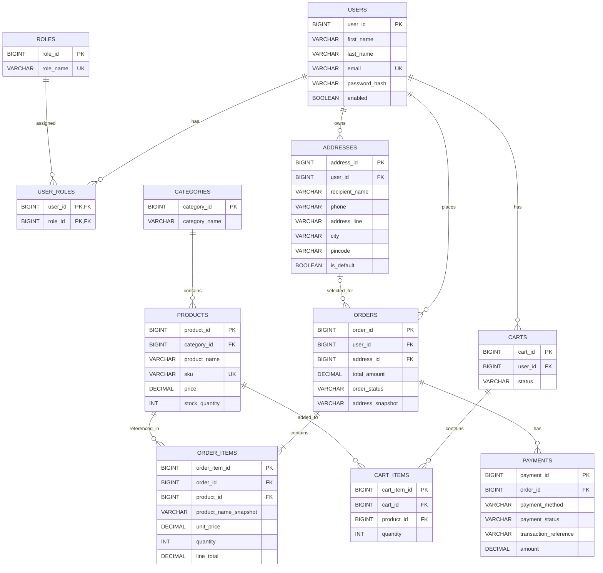

# SmartShop V2 – Entity Relationship Diagram

```mermaid
erDiagram
    USERS ||--o{ USER_ROLES : has
    ROLES ||--o{ USER_ROLES : assigned

    USERS ||--o{ ADDRESSES : owns
    USERS ||--o{ CARTS : has
    USERS ||--o{ ORDERS : places

    CATEGORIES ||--o{ PRODUCTS : contains

    CARTS ||--o{ CART_ITEMS : contains
    PRODUCTS ||--o{ CART_ITEMS : added_to

    ADDRESSES o|--o{ ORDERS : selected_for

    ORDERS ||--|{ ORDER_ITEMS : contains
    PRODUCTS ||--o{ ORDER_ITEMS : referenced_in

    ORDERS ||--o{ PAYMENTS : has

    USERS {
        BIGINT user_id PK
        VARCHAR first_name
        VARCHAR last_name
        VARCHAR email UK
        VARCHAR password_hash
        BOOLEAN enabled
    }

    ROLES {
        BIGINT role_id PK
        VARCHAR role_name UK
    }

    USER_ROLES {
        BIGINT user_id PK, FK
        BIGINT role_id PK, FK
    }

    ADDRESSES {
        BIGINT address_id PK
        BIGINT user_id FK
        VARCHAR recipient_name
        VARCHAR phone
        VARCHAR address_line
        VARCHAR city
        VARCHAR pincode
        BOOLEAN is_default
    }

    CATEGORIES {
        BIGINT category_id PK
        VARCHAR category_name
    }

    PRODUCTS {
        BIGINT product_id PK
        BIGINT category_id FK
        VARCHAR product_name
        VARCHAR sku UK
        DECIMAL price
        INT stock_quantity
    }

    CARTS {
        BIGINT cart_id PK
        BIGINT user_id FK
        VARCHAR status
    }

    CART_ITEMS {
        BIGINT cart_item_id PK
        BIGINT cart_id FK
        BIGINT product_id FK
        INT quantity
    }

    ORDERS {
        BIGINT order_id PK
        BIGINT user_id FK
        BIGINT address_id FK
        DECIMAL total_amount
        VARCHAR order_status
        VARCHAR address_snapshot
    }

    ORDER_ITEMS {
        BIGINT order_item_id PK
        BIGINT order_id FK
        BIGINT product_id FK
        VARCHAR product_name_snapshot
        DECIMAL unit_price
        INT quantity
        DECIMAL line_total
    }

    PAYMENTS {
        BIGINT payment_id PK
        BIGINT order_id FK
        VARCHAR payment_method
        VARCHAR payment_status
        VARCHAR transaction_reference
        DECIMAL amount
    }
```
